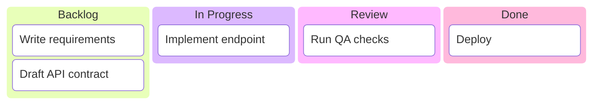
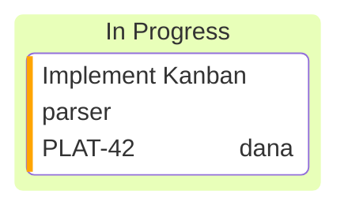
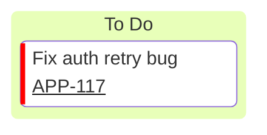

# Mermaid Kanban Diagramming

Create Mermaid Kanban boards from plain text. Keep boards readable, consistent, and easy to update in Git.

## Core Syntax Structure

Start every board with `kanban`, then define columns and tasks.

Use this pattern:
- `columnId[Column Label]` for columns (label is optional).
- `taskId[Task Description]` for tasks inside a column.
- Keep IDs short and stable so edits and diffs stay clean.

## Task Metadata

Add metadata to a task with `@{ ... }`.

Supported metadata fields:
- `assigned`: assignee name or handle.
- `ticket`: ticket number or key.
- `priority`: one of `Neutral`, `Very High`, `High`, `Low`, `Very Low`.

## Ticket Link Configuration

Set `kanban.ticketBaseUrl` in frontmatter so ticket metadata renders as links.

`#TICKET#` is replaced by each task's `ticket` value.

## Workflow

1. Translate the user's workflow into 3-6 columns.
2. Normalize task IDs (for example `task1`, `task2`) and concise labels.
3. Add metadata only where it helps (owner, ticket, priority).
4. Apply `ticketBaseUrl` when ticket links are required.
5. Validate visually by checking indentation and bracket pairs.

## Detailed Reference

Read [`references/kanban-diagrams.md`](references/kanban-diagrams.md) for:
- Syntax quick reference
- Reusable board templates
- Common parser failure patterns and fixes

## Best Practices

1. Keep one board focused on one workflow.
2. Use consistent column names across documents.
3. Avoid overlong task labels; move detail to ticket systems.
4. Use metadata sparingly to preserve scanability.
5. Prefer stable IDs to reduce noisy diffs.

## Common Pitfalls

- Missing brackets in `columnId[Label]` or `taskId[Label]`.
- Wrong metadata format (must be `@{ key: 'value' }`).
- Invalid `priority` value outside the supported set.
- Forgetting `#TICKET#` in `ticketBaseUrl`.
- Inconsistent indentation that makes structure hard to review.
