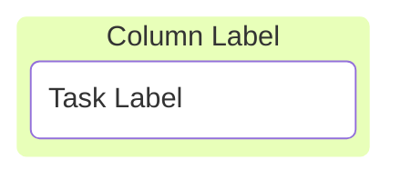
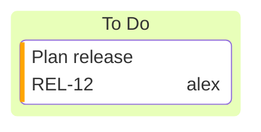
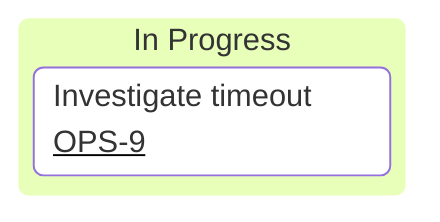
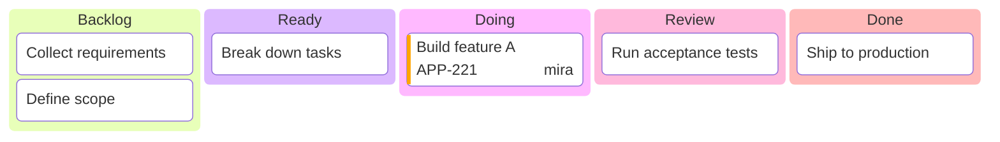
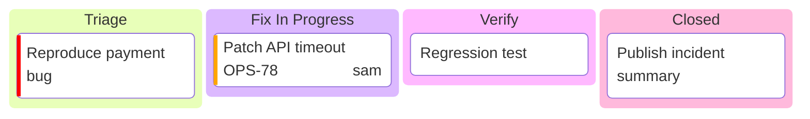

# Mermaid Kanban Reference

## Quick Reference

Use this minimal structure:

Use this metadata structure:

Metadata keys:
- `assigned`
- `ticket`
- `priority` (`Neutral`, `Very High`, `High`, `Low`, `Very Low`)

## Ticket URL Configuration

Set base ticket URL in frontmatter:

`#TICKET#` is replaced with the task ticket value.

## Reusable Templates

### Product Delivery Board

### Support Board

## Failure Patterns and Fixes

1. Diagram does not render:
- Confirm first non-frontmatter line is exactly `kanban`.

2. Tasks render outside columns:
- Ensure task lines are indented under a column line.

3. Metadata ignored:
- Use exact format `@{ key: 'value' }` on the same task line.

4. Ticket links do not open:
- Confirm `ticketBaseUrl` contains `#TICKET#`.
- Confirm each linked task has `ticket` metadata.

5. Priority style looks wrong:
- Use supported priority values only.

## Authoring Rules for This Skill

When producing Kanban output for users:
1. Keep column count between 3 and 7 unless the user explicitly asks otherwise.
2. Use concise, action-oriented task labels.
3. Add metadata only when it supports execution (owner, ticket, urgency).
4. Prefer stable task IDs so iterative updates produce clean diffs.
