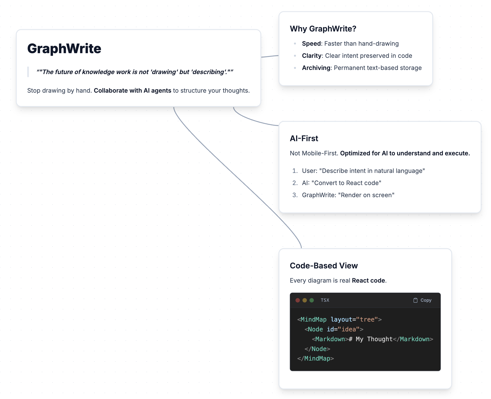

# GraphWrite

> **"The future of knowledge work is not 'drawing' but 'describing'."**



GraphWrite is a **programmable whiteboard for AI agent collaboration**.

Diagrams defined in code are **faster than hand-drawing, clearer in intent, and easier to archive**.
This app is designed **AI-First**, not Mobile-First.

## Installation

```
Install the skill from https://github.com/ev3rlit/graphwrite
```

## Philosophy

- **Describe, don't draw** — Tell the AI what you want; it writes React code that renders as diagrams
- **Code as archive** — All visuals are stored as readable, versionable React code
- **Auto-layout** — ELK engine handles positioning; you focus on logic

## Usage

Ask your AI agent to create diagrams:

```
"Create a mind map about microservices architecture"
"Draw a flowchart for user authentication"
"Visualize this system design as a tree diagram"
```

For detailed API and examples, ask the AI with `/graphwrite`:

```
/graphwrite show me the Node API
/graphwrite create a simple mind map example
```

## Examples

| File | Description |
|------|-------------|
| `mindmap.tsx` | MindMap features: node types, markdown, layouts |
| `styling.tsx` | Styling & sizing with Tailwind CSS |
| `icons.tsx` | Using emoji icons in Shapes and MindMap |
| `anchor_positioning.tsx` | Relative positioning with anchors |
| `node_links.tsx` | Node linking and edge examples |
| `multiple_mindmaps.tsx` | Multiple MindMaps on one canvas |
| `bubble.tsx` | Semantic Zoom: Bubble Label Example |

**Describe in words, archive in code. GraphWrite draws for you.**