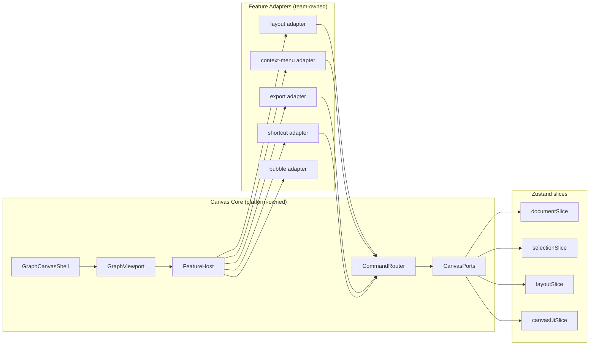
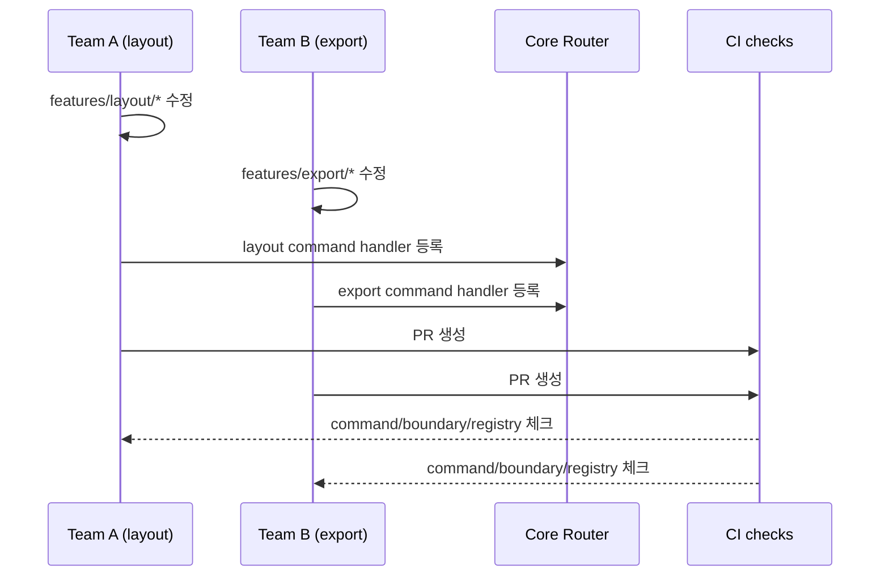

# Canvas Parallel Architecture (Command Router Only)

## 개요

이 문서는 `GraphCanvas` 중심 결합을 줄이고, 팀원/에이전트 병렬 작업 시 커밋 충돌을 최소화하기 위한 아키텍처를 정의한다.

핵심 목표:

1. 기능 추가 시 `/app/components/GraphCanvas.tsx`를 수정하지 않는다.
2. 기능별 작업 파일을 분리해 같은 파일 동시 수정 가능성을 낮춘다.
3. 유지보수 단순성을 위해 EventBus 없이 Command Router 단일 경로를 사용한다.

## 아키텍처 결정

### 채택: Command Router Only

- 상태 변경은 `dispatch(command)` 경로로만 수행
- 기능 간 직접 호출 금지
- 읽기는 `Ports` 계층으로만 접근

### 비채택: EventBus

- 이번 설계 범위에서 도입하지 않음
- 이유: 흐름 추적 복잡도 증가, 디버깅 비용 증가, 계약 표면 확대

## 타겟 구조



## 디렉토리 디자인

```text
app/components/canvas/
  core/
    GraphCanvasShell.tsx
    GraphViewport.tsx
    FeatureHost.tsx
  contracts/
    canvas-feature.ts
    commands.ts
    ports.ts
  runtime/
    command-router.ts
    create-ports.ts
  features/
    layout/
      index.ts
      feature.ts
      commands.ts
    context-menu/
      index.ts
      feature.ts
      commands.ts
    export/
      index.ts
      feature.ts
      commands.ts
    shortcuts/
      index.ts
      feature.ts
      commands.ts
    bubble/
      index.ts
      feature.ts
  registry/
    generated-features.ts
```

## 구현 계약 (How)

### 1) Command 스키마

`/app/components/canvas/contracts/commands.ts`

```ts
export type CanvasCommand =
  | { type: 'layout.run'; payload: { reason: 'graph-loaded' | 'manual' } }
  | { type: 'selection.set'; payload: { nodeIds: string[] } }
  | { type: 'export.dialog.open'; payload: { area: 'selection' | 'full'; nodeIds?: string[] } }
  | { type: 'viewport.fit'; payload: { duration?: number } };
```

규칙:

1. command type은 kebab-case가 아닌 `domain.action` 형태로 고정
2. payload 없는 command 금지
3. 동일 type 중복 선언 금지(검증 스크립트로 차단)

### 2) Command Router

`/app/components/canvas/runtime/command-router.ts`

```ts
type Handler<T extends CanvasCommand['type']> =
  (cmd: Extract<CanvasCommand, { type: T }>, ports: CanvasPorts) => void | Promise<void>;

export interface CommandRouter {
  dispatch: (cmd: CanvasCommand) => Promise<void>;
  register: <T extends CanvasCommand['type']>(type: T, handler: Handler<T>) => void;
}
```

규칙:

1. 한 command type 당 handler 1개만 허용
2. 미등록 command dispatch 시 명시적 에러
3. router 내부에서만 상태 변경 실행

### 3) Ports 계층

`/app/components/canvas/contracts/ports.ts`

```ts
export interface CanvasPorts {
  read: {
    nodes: () => Node[];
    edges: () => Edge[];
    selectedNodeIds: () => string[];
  };
  write: {
    setNodes: (nodes: Node[]) => void;
    setSelectedNodeIds: (ids: string[]) => void;
    openExportDialog: (area: 'selection' | 'full', nodeIds?: string[]) => void;
    fitView: (duration?: number) => void;
  };
}
```

규칙:

1. feature에서 `useGraphStore.getState()` 직접 사용 금지
2. feature에서 `setState` 직접 호출 금지
3. 읽기/쓰기는 ports 경유만 허용

### 4) Feature Adapter 계약

`/app/components/canvas/contracts/canvas-feature.ts`

```ts
export interface CanvasFeature {
  id: string;
  mount: (ctx: { router: CommandRouter; ports: CanvasPorts }) => () => void;
}
```

규칙:

1. feature는 `mount/unmount` 생명주기만 가짐
2. feature 간 import 금지
3. 공용 타입 의존은 `contracts/*`만 허용

## 충돌 최소화 장치

### 파일 소유권

| 영역 | 소유 팀 | 변경 빈도 |
|------|---------|-----------|
| `core/` | 플랫폼 | 낮음 |
| `contracts/` | 플랫폼 + 리뷰어 | 매우 낮음 |
| `runtime/command-router.ts` | 플랫폼 | 매우 낮음 |
| `features/layout` | 레이아웃 담당 | 중간 |
| `features/context-menu` | UX 담당 | 중간 |
| `features/export` | 미디어 담당 | 중간 |
| `features/shortcuts` | 인터랙션 담당 | 중간 |

### CI/린트 규칙

1. feature 간 import 차단(ESLint boundary)
2. feature 내부 store direct access 차단
3. command type 중복 검사
4. generated registry 최신성 검사

## 협업 시퀀스



## 성공 기준

1. 2개 이상 팀 동시 작업 시 동일 파일 충돌이 주당 1회 이하
2. 기능 PR의 80% 이상이 `features/<name>` 내부 변경만 포함
3. `GraphCanvasShell` 월 변경 횟수 2회 이하

