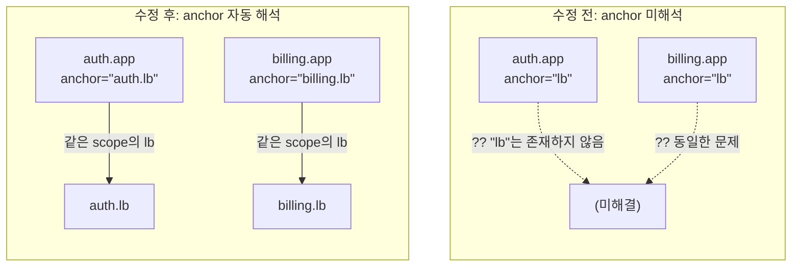
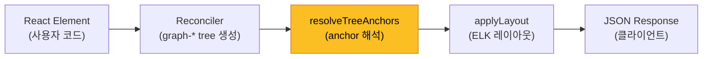
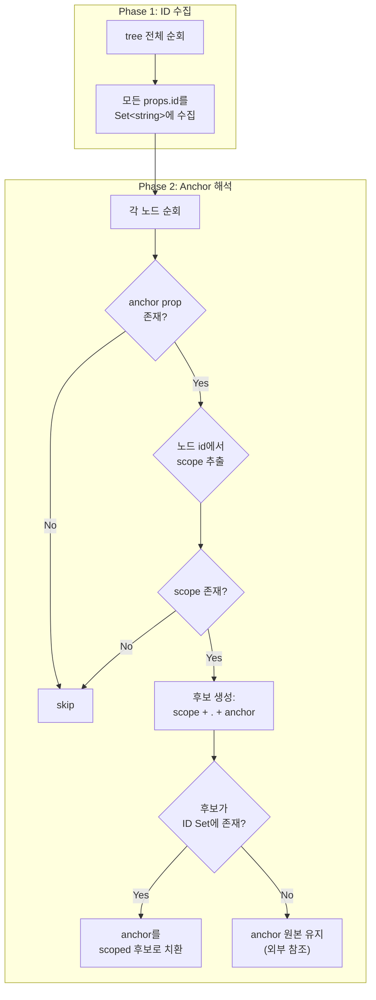
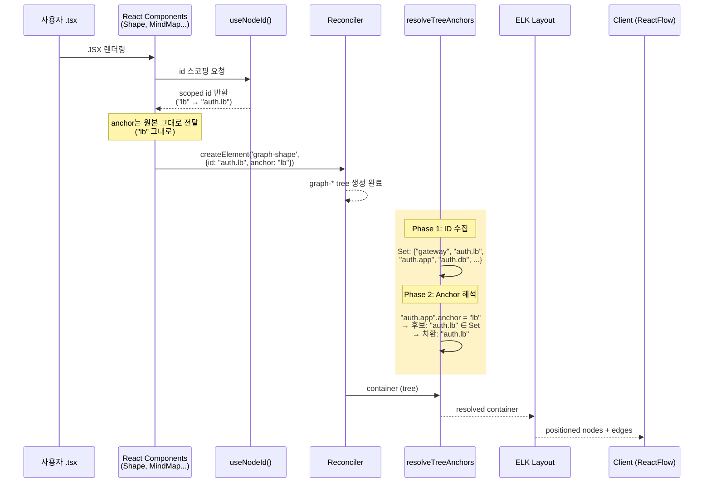

# EmbedScope Anchor Resolution

## 문제 정의

EmbedScope는 `id` prop을 `useNodeId()` hook으로 스코핑하지만,
`anchor` prop은 스코핑하지 않았습니다. 이로 인해 동일 컴포넌트를 여러 번 재사용할 때
**anchor가 잘못된 노드를 참조**하는 문제가 발생합니다.

### 문제 시나리오

```tsx
function ServiceCluster() {
    return (
        <>
            <Shape id="lb" anchor="gateway" position="bottom" ... />
            <Shape id="app" anchor="lb" position="bottom" ... />
            {/*                 ^^^^^ 이 "lb"는 어디를 가리키는가? */}
            <Shape id="db" anchor="app" position="bottom" ... />
        </>
    );
}

export default function Example() {
    return (
        <Canvas>
            <Shape id="gateway" x={0} y={0} ... />
            <EmbedScope id="auth">
                <ServiceCluster />
            </EmbedScope>
            <EmbedScope id="billing">
                <ServiceCluster />
            </EmbedScope>
        </Canvas>
    );
}
```



### 스코핑 비교표

| prop | 수정 전 | 수정 후 |
|------|---------|---------|
| `id="lb"` (auth scope) | `"auth.lb"` | `"auth.lb"` |
| `id="app"` (auth scope) | `"auth.app"` | `"auth.app"` |
| `anchor="lb"` (auth scope) | `"lb"` (잘못된 참조) | `"auth.lb"` (올바른 참조) |
| `anchor="gateway"` (auth scope) | `"gateway"` | `"gateway"` (외부 노드이므로 유지) |

---

## 해결 전략: Tree Post-Processing

### 왜 컴포넌트 레벨에서 해결하지 않는가

`id`는 `useNodeId()` hook으로 컴포넌트 렌더링 시점에 스코핑됩니다.
하지만 `anchor`를 같은 방식으로 처리하면 **외부 참조를 구분할 수 없습니다**.

```
anchor="lb"       → 같은 scope의 lb? (auth.lb)
anchor="gateway"  → 외부 노드 gateway? (gateway)
```

렌더링 시점에는 "auth.lb가 실제로 존재하는가?"를 알 수 없습니다.
전체 tree가 완성된 **이후에** 모든 노드 ID를 수집해야 판단이 가능합니다.

### 해결: Reconciler 후처리 단계



Reconciler가 tree를 완성한 뒤, layout 엔진에 전달하기 **직전**에
post-processing 단계(`resolveTreeAnchors`)를 삽입합니다.

---

## 알고리즘

### 2-Phase 처리



### Scope 추출 규칙

노드 자신의 `id`에서 마지막 `.` 앞까지를 scope로 추출합니다.

```
id: "auth.app"        → scope: "auth"
id: "infra.aws.ec2"   → scope: "infra.aws"
id: "gateway"         → scope: "" (없음, 루트)
```

### 구체적 예시

tree에 다음 노드들이 존재한다고 가정:

```
ID Set: { "gateway", "auth.lb", "auth.app", "auth.db",
           "billing.lb", "billing.app", "billing.db" }
```

| 노드 id | anchor (원본) | scope | 후보 | ID Set에 존재? | 결과 |
|---------|--------------|-------|------|--------------|------|
| `auth.lb` | `gateway` | `auth` | `auth.gateway` | No | `gateway` (유지) |
| `auth.app` | `lb` | `auth` | `auth.lb` | Yes | `auth.lb` (치환) |
| `auth.db` | `app` | `auth` | `auth.app` | Yes | `auth.app` (치환) |
| `billing.app` | `lb` | `billing` | `billing.lb` | Yes | `billing.lb` (치환) |
| `billing.db` | `app` | `billing` | `billing.app` | Yes | `billing.app` (치환) |

---

## 구현

### 파일 구조

```
libs/core/src/
├── renderer.ts                          # 수정: resolveTreeAnchors 호출 추가
└── reconciler/
    ├── hostConfig.ts                    # 변경 없음
    └── resolveTreeAnchors.ts            # 신규: anchor 해석 로직
```

### resolveTreeAnchors.ts

```typescript
import { Container, Instance } from './hostConfig';

export function resolveTreeAnchors(container: Container): Container {
    const nodeIds = new Set<string>();

    // Phase 1: 전체 tree에서 node ID 수집
    function collectIds(instances: Instance[]) {
        for (const inst of instances) {
            if (inst.props['id']) nodeIds.add(inst.props['id']);
            collectIds(inst.children);
        }
    }
    collectIds(container.children);

    // Phase 2: anchor prop 해석
    function resolveInstances(instances: Instance[]): Instance[] {
        return instances.map(inst => {
            let props = inst.props;

            if (props['anchor'] && props['id']) {
                const anchor = props['anchor'] as string;
                const id = props['id'] as string;
                const dotIdx = id.lastIndexOf('.');
                const scope = dotIdx > -1 ? id.substring(0, dotIdx) : '';

                // scope가 있고, anchor가 아직 qualified되지 않은 경우
                if (scope && !anchor.includes('.')) {
                    const scopedAnchor = `${scope}.${anchor}`;
                    if (nodeIds.has(scopedAnchor)) {
                        props = { ...props, anchor: scopedAnchor };
                    }
                }
            }

            return { ...inst, props, children: resolveInstances(inst.children) };
        });
    }

    return { ...container, children: resolveInstances(container.children) };
}
```

### renderer.ts 변경

```diff
 import { applyLayout } from './layout/elk';
+import { resolveTreeAnchors } from './reconciler/resolveTreeAnchors';

 // renderToGraph 내부:
   .andThen((status) => {
     if (status === 'ERROR' || capturedError) {
       return err(new RenderError('Reconciliation failed', capturedError));
     }
-    return ok(container);
+    return ok(resolveTreeAnchors(container));
   }).andThen(applyLayout);
```

---

## 렌더링 파이프라인 전체 흐름

anchor 해석이 파이프라인 어디에 위치하는지를 보여줍니다.



---

## 엣지 케이스

### 1. 이미 qualified된 anchor

```tsx
<EmbedScope id="auth">
    <Shape id="app" anchor="billing.lb" position="right" ... />
</EmbedScope>
```

`anchor="billing.lb"`은 `.`을 포함하므로 해석하지 않습니다.
사용자가 의도적으로 다른 scope의 노드를 참조하는 것으로 판단합니다.

### 2. 중첩 EmbedScope

```tsx
<EmbedScope id="infra">           // scope: "infra"
    <EmbedScope id="aws">         // scope: "infra.aws"
        <Shape id="vpc" ... />    // id: "infra.aws.vpc"
        <Shape id="ec2" anchor="vpc" ... />
        {/* scope: "infra.aws", 후보: "infra.aws.vpc" → 존재 → 치환 */}
    </EmbedScope>
</EmbedScope>
```

`lastIndexOf('.')`로 가장 가까운 scope를 추출하므로
중첩된 scope에서도 올바르게 동작합니다.

### 3. EmbedScope 없는 경우

```tsx
<Canvas>
    <Shape id="a" x={0} y={0} ... />
    <Shape id="b" anchor="a" position="right" ... />
</Canvas>
```

`id="b"`에 `.`이 없으므로 scope는 `""`입니다.
scope가 비어있으면 해석을 건너뜁니다.
기존 동작에 영향을 주지 않습니다.

### 4. MindMap의 anchor

```tsx
<EmbedScope id="infra">
    <Shape id="ref" x={0} y={0} ... />
    <MindMap id="map" anchor="ref" position="bottom" ...>
        <Node id="root" ... />
    </MindMap>
</EmbedScope>
```

MindMap도 `anchor` prop을 가집니다. id가 `"infra.map"`이므로
scope `"infra"`에서 `"infra.ref"`를 찾아 치환합니다.

---

## 테스트 커버리지

`libs/core/src/__tests__/embedScope.spec.tsx`에 추가된 테스트:

| 테스트 | 검증 내용 |
|--------|----------|
| scope 내부 anchor 해석 | `anchor="lb"` inside `auth` scope → `"auth.lb"` |
| 외부 anchor 유지 | `anchor="gateway"` → scoped 후보 없음 → `"gateway"` 유지 |
| 중첩 scope anchor | `anchor="vpc"` in `infra.aws` → `"infra.aws.vpc"` |
| MindMap anchor | MindMap의 `anchor="ref"` → `"infra.ref"` |
| 존재하지 않는 후보 | scoped 후보가 ID Set에 없으면 원본 유지 |

---

## 설계 결정 요약

| 결정 | 선택 | 이유 |
|------|------|------|
| 해석 시점 | Reconciler 후처리 | 전체 ID 목록이 필요하므로 tree 완성 후에만 가능 |
| 해석 방식 | ID Set 기반 존재 확인 | 후보가 존재할 때만 치환하여 외부 참조를 보존 |
| scope 추출 | `id.lastIndexOf('.')` | 가장 가까운 상위 scope를 정확히 추출 |
| qualified 판별 | `anchor.includes('.')` | `useNodeId`와 동일한 규칙 재사용 |
| 불변성 | container를 shallow copy | 원본 tree를 변경하지 않음 |
