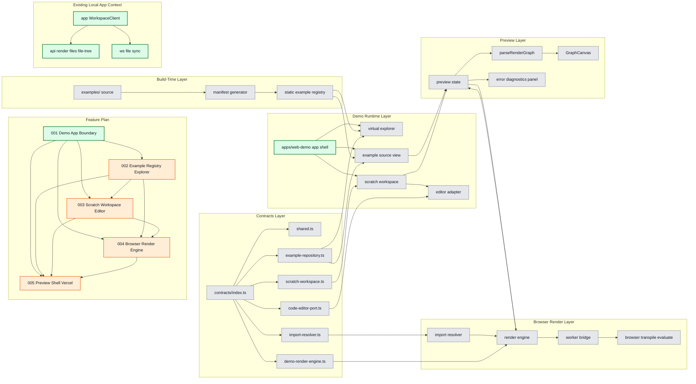

# Web Demo Subfeature 001: Demo App Boundary

## 목적

기존 로컬 워크스페이스 앱과 web demo의 앱/패키지/네트워크 경계를 분리한다.

## 레이어 다이어그램

색상 규칙:

- 초록: 이번 단계에서 직접 작업하는 영역
- 주황: 이번 단계의 영향을 받는 후속 영역
- 파랑: 선행 의존 작업 번호
- 회색: 참고 컨텍스트

## 핵심 책임

- `apps/web-demo` 앱 스캐폴드 정의
- 기존 웹과 분리된 별도 Vercel 프로젝트 배포 경계 정의
- 루트 workspace 연결 지점 정의
- demo 앱에서 기존 `/api/*`, WebSocket, `WorkspaceClient` 흐름을 사용하지 않도록 차단
- demo 앱 범위에서 채팅 세션, 그룹, 메시지, provider 선택 기능을 제외

## 작업량 판단

- 중요도: 높음
- 작업량: 중간
- 성격: 선행 의존성

## 선행/후행 관계

- 선행 없음
- 후행:
  - `002-example-registry-explorer`
  - `003-scratch-workspace-editor`
  - `004-browser-render-engine`
  - `005-preview-shell-vercel`

## 완료 기준

- demo 앱의 진입 구조가 고정된다.
- 기존 `app`과 demo 앱 사이의 의존 방향 규칙이 정리된다.
- demo 앱 범위에서 chat/session/group 관련 기능이 명시적으로 제외된다.
- demo 앱이 기존 웹과 분리된 별도 Vercel 프로젝트로 배포된다는 원칙이 고정된다.

## 이번 단계 작업 / 영향 / 의존

- 작업 대상: `F001`, `apps/web-demo app shell`, 기존 로컬 앱 경계
- 영향 대상: `F002`, `F003`, `F004`, `F005`
- 선행 의존 번호: 없음

## 범위 제약

- web demo에서는 채팅 세션이 필요 없다.
- web demo는 기존 웹과 분리된 별도 Vercel 프로젝트로 배포한다.
- 따라서 아래 기능은 demo 앱 범위에서 제외한다.
  - chat panel
  - session sidebar
  - group manager
  - provider selector
  - chat persistence
- 이 제약은 이후 `005-preview-shell-vercel`의 최소 헤더 설계에도 그대로 반영한다.
