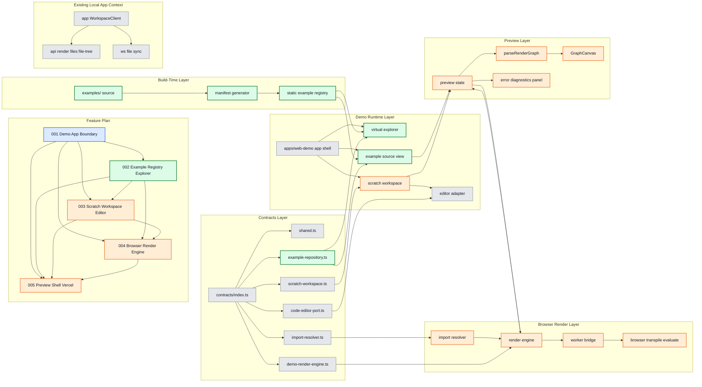

# Web Demo Subfeature 002: Example Registry Explorer

## 목적

`examples/`를 읽기 전용 정적 데이터로 변환하고, 가상 파일 탐색기 UX를 제공한다.

## 레이어 다이어그램

색상 규칙:

- 초록: 이번 단계에서 직접 작업하는 영역
- 주황: 이번 단계의 영향을 받는 후속 영역
- 파랑: 선행 의존 작업 번호
- 회색: 참고 컨텍스트

## 핵심 책임

- build-time manifest 생성
- `ExampleRepository` 계약 기준 트리/소스 제공 구조 정의
- 가상 파일 탐색기와 read-only source view 연결
- 포함 파일 기준 큐레이션과 수동 override 메타데이터 반영

## 작업량 판단

- 중요도: 높음
- 작업량: 중간
- 성격: 선행 의존성 + 사용자 가시 기능

## 선행/후행 관계

- 선행:
  - `001-demo-app-boundary`
- 후행:
  - `003-scratch-workspace-editor`
  - `004-browser-render-engine`
  - `005-preview-shell-vercel`

## 완료 기준

- API 없이 예제 트리와 소스를 읽을 수 있다.
- 사용자가 파일을 선택하면 예제 코드와 렌더 대상이 바뀐다.
- 기본 예제는 `examples/readme.tsx`로 시작하고 override로 바꿀 수 있다.

## 이번 단계 작업 / 영향 / 의존

- 작업 대상: `F002`, `examples/ source`, `manifest generator`, `static example registry`, `ExampleRepository`, `virtual explorer`, `example source view`
- 영향 대상: `scratch workspace`, `preview state`, `render engine`
- 선행 의존 번호: `F001`

## 구현 결정

- manifest는 build 시에만 생성한다.
- 전체 자동 노출이 아니라 포함 파일 기준으로 명시적으로 선택한다.
- 파일명 기반 자동 메타데이터를 기본으로 하되, 수동 override 파일을 허용한다.
- 기본 진입 파일은 `examples/readme.tsx`로 시작하되 override로 교체 가능해야 한다.
