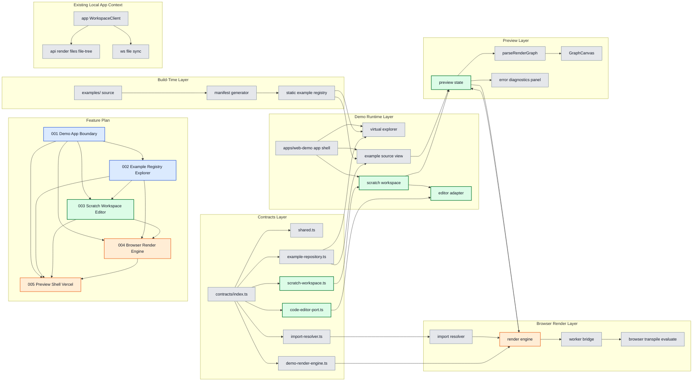

# Web Demo Subfeature 003: Scratch Workspace Editor

## 목적

읽기 전용 example source를 편집 가능한 메모리 scratch 문서로 복제하고, 에디터 UX를 제공한다.

## 레이어 다이어그램

색상 규칙:

- 초록: 이번 단계에서 직접 작업하는 영역
- 주황: 이번 단계의 영향을 받는 후속 영역
- 파랑: 선행 의존 작업 번호
- 회색: 참고 컨텍스트

## 핵심 책임

- `ScratchWorkspace` 계약 기준 메모리 문서 수명주기 정의
- `CodeEditorPort` 계약 기준 editor mount/lifecycle 정의
- `Edit in Scratch`, `Reset`, `Copy` UX 정의

## 작업량 판단

- 중요도: 높음
- 작업량: 중간 이상
- 성격: 의존성 구현 + 사용자 가시 기능

## 선행/후행 관계

- 선행:
  - `001-demo-app-boundary`
  - `002-example-registry-explorer`
- 후행:
  - `004-browser-render-engine`
  - `005-preview-shell-vercel`

## 완료 기준

- scratch 문서가 메모리에서 생성, 수정, 리셋된다.
- 원본 example source는 항상 읽기 전용으로 유지된다.
- scratch 문서는 한 번에 하나만 유지된다.
- 새로고침 시 `sessionStorage` 범위 내에서 복원된다.

## 이번 단계 작업 / 영향 / 의존

- 작업 대상: `F003`, `ScratchWorkspace`, `CodeEditorPort`, `scratch workspace`, `editor adapter`, `preview state`
- 영향 대상: `F004`, `F005`, `render engine`
- 선행 의존 번호: `F001`, `F002`

## 구현 결정

- scratch는 메모리 기반이 기본이지만, 새로고침 복구를 위해 `sessionStorage`까지 허용한다.
- editor는 `CodeMirror`로 고정한다.
- scratch 문서는 한 번에 하나만 연다.
- dirty indicator는 제공하지 않는다.
