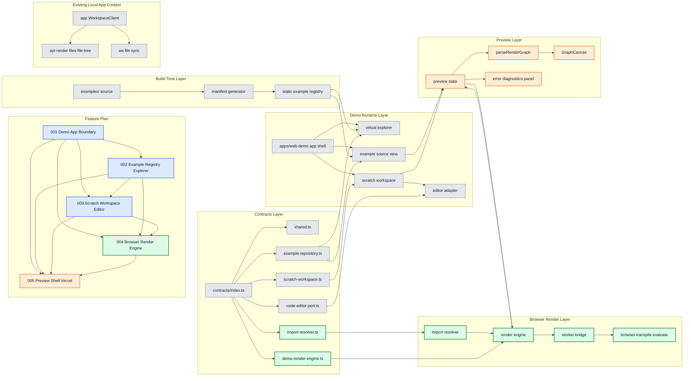

# Web Demo Subfeature 004: Browser Render Engine

## 목적

서버 없는 브라우저 환경에서 TSX source를 graph 결과로 변환하는 렌더 파이프라인을 정의한다.

## 레이어 다이어그램



색상 규칙:

- 초록: 이번 단계에서 직접 작업하는 영역
- 주황: 이번 단계의 영향을 받는 후속 영역
- 파랑: 선행 의존 작업 번호
- 회색: 참고 컨텍스트

## 핵심 책임

- `DemoRenderEngine` 계약 정의 및 구현 방향 확정
- `DemoImportResolver` 기준 상대 import 처리
- worker 기반 transpile/evaluate/render 흐름 정리
- diagnostics와 stale result 처리 정책 정리

## 작업량 판단

- 중요도: 최고
- 작업량: 가장 큼
- 성격: 핵심 구현 + 가장 큰 기술 리스크

## 왜 가장 큰가

- 현재 서버가 담당하는 번들링, 실행, graph 생성 책임을 브라우저로 재설계해야 한다.
- import 해석, worker 격리, 성능, 오류 복구가 한 번에 얽혀 있다.
- Vercel 데모 성패가 이 축에 가장 많이 걸린다.

## 선행/후행 관계

- 선행:
  - `001-demo-app-boundary`
  - `002-example-registry-explorer`
  - `003-scratch-workspace-editor`
- 후행:
  - `005-preview-shell-vercel`

## 완료 기준

- example source와 scratch source가 브라우저 안에서 graph 결과로 변환된다.
- 오류가 diagnostics로 반환되고 마지막 정상 프리뷰 유지 전략과 결합 가능하다.

## 이번 단계 작업 / 영향 / 의존

- 작업 대상: `F004`, `DemoImportResolver`, `DemoRenderEngine`, `import resolver`, `render engine`, `worker bridge`, `browser transpile evaluate`
- 영향 대상: `F005`, `preview state`, `parseRenderGraph`, `GraphCanvas`, `error diagnostics panel`
- 선행 의존 번호: `F001`, `F002`, `F003`

## 구현 계획

이 서브 피쳐는 별도 구현 계획 파일로 분리하지 않고, 본 `README.md` 안에서 구현 계획까지 함께 관리한다.

### 구현 목표

- 브라우저 안에서 example source와 scratch source를 graph 결과로 변환한다.
- `docs/features/webdemo/contracts/demo-render-engine.ts` 와 `docs/features/webdemo/contracts/import-resolver.ts` 계약을 실제 런타임 진입점으로 연결한다.
- UI 스레드 차단 없이 worker 기반 렌더를 수행한다.
- syntax/runtime/import 오류를 `diagnostics`로 정규화한다.

### 현재 서버 파이프라인과의 대응 관계

현재 서버 파이프라인:

1. 파일 읽기
2. `esbuild` 번들링
3. Node `require` 기반 실행
4. `renderToGraph`
5. 결과와 오류 반환

브라우저 파이프라인 목표:

1. 정적 registry 또는 scratch store에서 source 확보
2. `DemoImportResolver` 로 상대 import 해석
3. worker 안에서 transpile
4. 브라우저 안전 경계에서 모듈 평가
5. `renderToGraph`
6. `DemoRenderResponse` 반환

### 구현 원칙

1. UI는 worker와 메시지 계약만 알고, transpile 세부는 직접 다루지 않는다.
2. source resolution, transpile, evaluate, graph 생성은 `DemoRenderEngine` 뒤로 숨긴다.
3. runtime 오류와 syntax 오류는 모두 `DemoDiagnostic[]` 로 수렴시킨다.
4. 최초 구현은 지원 범위를 좁혀도 되지만, 계약은 넓게 유지한다.
5. import 해석 실패는 silent fallback 없이 명시적 diagnostics 로 노출한다.

### 권장 모듈 구조

```text
apps/web-demo/lib/render/
  render-engine.ts
  render-engine-client.ts
  diagnostics.ts
  source-version.ts

apps/web-demo/lib/examples/
  import-resolver.ts

apps/web-demo/workers/
  demo-render.worker.ts
  worker-runtime.ts
```

### 세부 구현 항목

#### 1. Worker bridge

- 메인 스레드에 `render-engine-client.ts` 를 둔다.
- singleton worker 생성과 재사용 정책을 여기서 관리한다.
- 요청마다 `requestId`를 부여한다.
- 가장 최신 요청만 유효하도록 stale result drop 로직을 둔다.

#### 2. Import resolution

- `DemoImportResolver` 구현은 example registry와 scratch document 둘 다 읽을 수 있어야 한다.
- 우선 지원 범위:
  - `./foo`
  - `../foo`
  - 확장자 생략
  - `.tsx`
- 초기 비지원 범위:
  - npm 외부 패키지 import
  - 동적 import
  - Node 내장 모듈

#### 3. Transpile

- worker 내부에서 `esbuild-wasm` 기반 transpile을 수행한다.
- output format은 브라우저 평가가 가능한 단일 JS 문자열이어야 한다.
- build input은 entry source + resolved dependency map 기준으로 구성한다.

#### 4. Evaluation

- worker 내부 평가 단계는 브라우저에서 허용 가능한 최소 런타임으로 제한한다.
- default export function 또는 default React element를 받을 수 있는지 정책을 명확히 정한다.
- 실행 실패 시 stack을 직접 UI에 노출하지 않고 diagnostics 로 정규화한다.

#### 5. Graph generation

- 평가 결과가 React element를 반환하면 `renderToGraph`를 호출한다.
- graph 생성 성공 시 `graph`, `sourceVersion`, `diagnostics=[]` 를 반환한다.
- sourceVersion은 source + resolved dependencies 해시 기준으로 계산한다.

#### 6. Diagnostics normalization

- syntax error
- import resolution error
- execution error
- renderToGraph error

위 4종류를 공통 포맷으로 정규화한다.

### 단계별 구현 순서

#### Step 1. Worker 계약과 클라이언트 껍데기

- worker 요청/응답 메시지 구조 고정
- requestId, cancel 무시, stale drop 정책 구현

#### Step 2. Import resolver 구현

- registry 기반 상대 경로 해석
- scratch 우선/registry 폴백 규칙 정의

#### Step 3. Transpile 경로 연결

- `esbuild-wasm` 초기화
- 단일 파일 입력에서 기본 transpile 성공 확인

#### Step 4. Dependency-aware bundle

- import map을 포함한 다중 소스 번들 경로 구성
- 상대 import가 있는 예제 스모크 테스트

#### Step 5. Evaluation + renderToGraph

- 평가 결과를 `renderToGraph` 와 연결
- graph 생성 성공/실패 분기 정리

#### Step 6. Diagnostics + sourceVersion

- 오류 유형 정규화
- sourceVersion 계산

#### Step 7. Preview integration handoff

- `005-preview-shell-vercel` 이 붙일 수 있는 안정 API로 마감

### 결정 사항

- 최초 구현은 browser-only 이며 서버 fallback을 두지 않는다.
- import 지원 범위는 example registry 안의 상대 파일로 제한한다.
- 외부 패키지 import 지원은 이번 범위에 포함하지 않는다.
- 허용 import는 상대 import와 런타임 allowlist(`react`, `@magam/core`) 수준으로 제한한다.
- worker는 단일 인스턴스를 기본값으로 한다.
- 지원 export 형태는 `default export function` 또는 `default export element`로 제한한다.

### 테스트 계획

#### 단위 테스트

- import path resolution
- diagnostics normalization
- sourceVersion hashing
- stale response 무시

#### 통합 테스트

- 단일 파일 example render 성공
- 상대 import 포함 example render 성공
- syntax error diagnostics 반환
- import missing diagnostics 반환
- runtime error diagnostics 반환

#### 수동 QA

- 큰 example 수정 중 UI freeze 여부 확인
- 빠른 연속 입력에서 이전 결과가 덮어쓰지 않는지 확인
- 마지막 정상 프리뷰와 결합 시나리오는 `005`와 함께 점검

### 주요 리스크와 대응

#### 리스크 1. 브라우저 번들 비용 과다

- 초기에는 지원 example 범위를 제한한다.
- worker lazy init을 적용한다.
- transpile 캐시를 도입할 여지를 남긴다.

#### 리스크 2. 평가 환경 차이

- Node 전용 API 사용 예제는 지원 대상에서 제외한다.
- 브라우저 평가 가능 범위를 문서화한다.

#### 리스크 3. import 해석 복잡도 증가

- 상대 import부터 지원한다.
- alias, package import는 후속 범위로 밀어낸다.
