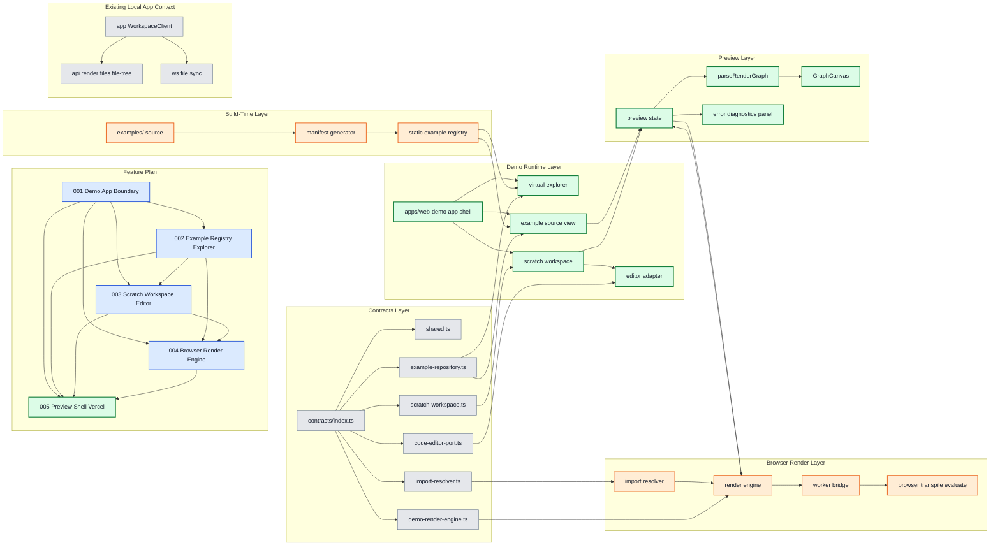

# Web Demo Subfeature 005: Preview Shell and Vercel Hardening

## 목적

렌더 결과를 사용자에게 안정적으로 보여주는 preview shell을 만들고, 실제 Vercel 배포 품질을 확보한다.

## 레이어 다이어그램

색상 규칙:

- 초록: 이번 단계에서 직접 작업하는 영역
- 주황: 이번 단계의 영향을 받는 후속 영역
- 파랑: 선행 의존 작업 번호
- 회색: 참고 컨텍스트

## 핵심 책임

- preview 상태 머신과 `lastGoodGraph` 유지 정책 연결
- 모바일/데스크톱 레이아웃 정리
- worker/editor/manifest 번들 포함 방식 검증
- 실제 Vercel preview 배포 검증 항목 정리
- 최소 헤더 구성과 chat-free demo shell 확정

## 작업량 판단

- 중요도: 높음
- 작업량: 중간
- 성격: 통합 마감

## 선행/후행 관계

- 선행:
  - `001-demo-app-boundary`
  - `002-example-registry-explorer`
  - `003-scratch-workspace-editor`
  - `004-browser-render-engine`

## 완료 기준

- 프리뷰, 오류, 로딩 UX가 연결된다.
- Vercel preview에서 주요 사용자 흐름이 재현된다.
- 헤더가 최소 정보만 유지하고 chat 진입이 제거된다.

## 이번 단계 작업 / 영향 / 의존

- 작업 대상: `F005`, `preview state`, `parseRenderGraph`, `GraphCanvas`, `error diagnostics panel`, `apps/web-demo app shell`
- 영향 대상: 빌드 산출물 포함 방식, worker/editor/manifest 통합 지점
- 선행 의존 번호: `F001`, `F002`, `F003`, `F004`

## 구현 계획

이 서브 피쳐는 별도 구현 계획 파일로 분리하지 않고, 본 `README.md` 안에서 구현 계획까지 함께 관리한다.

### 구현 목표

- `004-browser-render-engine` 결과를 실제 사용자 경험으로 연결한다.
- `lastGoodGraph` 유지 정책, 로딩 상태, 오류 상태를 하나의 preview shell 안에 통합한다.
- 데스크톱과 모바일에서 모두 시연 가능한 레이아웃을 만든다.
- 실제 Vercel preview 배포에서 worker, editor, manifest 자산이 정상 포함되도록 마감한다.
- 채팅 세션 없이도 데모 가치가 전달되는 최소 shell을 만든다.

### Preview shell 책임 범위

1. example source 또는 scratch source 변경을 감지한다.
2. 렌더 요청을 보낸다.
3. 로딩/성공/실패 상태를 관리한다.
4. 마지막 정상 프리뷰를 유지한다.
5. diagnostics 패널을 표시한다.
6. `parseRenderGraph` 와 `GraphCanvas` 를 연결한다.

### 상태 모델

권장 상태:

- `selectedExampleId`
- `activeMode`
- `scratchDocumentId`
- `previewStatus`
- `currentDiagnostics`
- `lastGoodGraph`
- `lastSuccessfulSourceVersion`
- `inFlightRequestId`

핵심 규칙:

- loading 중이라도 `lastGoodGraph` 가 있으면 계속 보여준다.
- error 상태에서도 `lastGoodGraph` 가 있으면 canvas는 유지한다.
- error 상태에서 `lastGoodGraph` 가 없으면 빈 preview placeholder를 보여준다.
- 에러 시에도 마지막 성공 렌더를 유지하는 기본 정책 외에 demo 전용 특수 복구 로직은 추가하지 않는다.

### UI 구성 계획

#### 최소 헤더 원칙

- 헤더는 demo 식별과 현재 문맥 전달에 필요한 최소 요소만 유지한다.
- 채팅 진입, 세션 전환, provider 선택, 협업 관련 액션은 포함하지 않는다.

권장 헤더 항목:

- demo title 또는 wordmark
- 현재 선택한 example 이름
- 현재 모드 표시
  - `Example`
  - `Scratch`
- 핵심 액션 1~2개
  - `Edit in Scratch`
  - `Reset`

#### 데스크톱

- 좌측: code 영역 내부의 explorer/code 탭
- 우측: 항상 보이는 preview

#### 모바일

- preview만 표시한다.
- explorer와 code는 기본 모바일 범위에서 숨긴다.

### Preview 렌더 흐름

1. 사용자가 example 선택 또는 scratch 수정
2. preview shell이 렌더 입력 생성
3. `DemoRenderEngine.render` 호출
4. `previewStatus='loading'`
5. 결과 수신
6. 성공 시:
   - `parseRenderGraph`
   - `lastGoodGraph` 갱신
   - `previewStatus='ready'`
7. 실패 시:
   - `currentDiagnostics` 갱신
   - `previewStatus='error'`
   - `lastGoodGraph` 유지

### parseRenderGraph / GraphCanvas 연결 원칙

- preview shell은 graph raw result와 view state를 분리해서 보관한다.
- `parseRenderGraph` 실패도 diagnostics 로 다룰 수 있게 감싼다.
- `GraphCanvas`는 가능하면 viewer 역할만 맡기고, demo 편집 동기화 로직은 포함하지 않는다.

### 오류 UX 계획

오류 패널은 아래를 보여준다.

- 오류 타입
- 메시지
- 파일명
- line/column
- 복구 액션

복구 액션 후보:

- `Reset to Example`
- `Back to Example View`

### 제외되는 UI

- chat panel
- session sidebar
- group manager
- provider selector
- 기존 workspace header의 확장 액션들
- footer

### Vercel hardening 계획

#### 1. 자산 포함 확인

- worker 파일이 build output에 포함되는지
- `esbuild-wasm` 자산 경로가 올바른지
- editor lazy chunk가 분리되는지
- example manifest가 정적 import 또는 build artifact로 포함되는지

#### 2. 런타임 제약 확인

- `localhost` 의존 없음
- Node 전용 API 직접 호출 없음
- 브라우저만으로 첫 진입부터 preview 가능

#### 3. 성능 제어

- editor lazy load
- worker lazy init
- first preview를 위한 기본 example preload 여부 검토

### 단계별 구현 순서

#### Step 1. Preview state container

- preview 전용 state 정의
- `lastGoodGraph`, `currentDiagnostics`, `inFlightRequestId` 구조 고정

#### Step 2. Result handling

- success/error/loading 전환
- stale result drop과 상태 연결

#### Step 3. Canvas integration

- `parseRenderGraph` 연결
- `GraphCanvas` viewer 모드 연결

#### Step 4. Error panel and recovery actions

- diagnostics panel 구현
- reset/back 액션 구현

#### Step 5. Responsive shell

- 데스크톱 2열 구조
  - 좌측 code 영역 내부 explorer/code 탭
  - 우측 항상 visible preview
- 모바일 preview 전용 구조
- 최소 헤더와 chat-free shell 확정

#### Step 6. Vercel hardening

- build output 확인
- preview deploy smoke test

### 테스트 계획

#### 단위 테스트

- preview 상태 전이
- lastGoodGraph 유지
- diagnostics 표시 조건

#### 컴포넌트 테스트

- loading overlay
- error panel
- recovery actions

#### 통합 테스트

- example 선택 후 preview 성공
- scratch 수정 후 preview 갱신
- render error 후 마지막 정상 프리뷰 유지
- diagnostics와 복구 액션 정상 동작

#### 배포 검증

- Vercel preview build 성공
- 첫 진입에서 기본 example 프리뷰 노출
- scratch 수정 후 preview가 계속 갱신되는지 확인

### 주요 리스크와 대응

#### 리스크 1. preview shell이 기존 app UI와 과도하게 닮아 경계가 흐려짐

- demo 전용 shell 컴포넌트로 분리한다.
- 기존 workspace-specific control은 포함하지 않는다.

#### 리스크 2. 에러 상태에서 빈 화면 체감

- 항상 `lastGoodGraph` 우선 유지 정책을 따른다.
- 첫 렌더 실패 시에는 placeholder와 diagnostics를 함께 보여준다.

#### 리스크 3. Vercel 환경에서 worker/wasm 경로 문제

- preview deploy 기준으로 경로를 확정한다.
- 로컬만 통과하는 설정은 허용하지 않는다.
