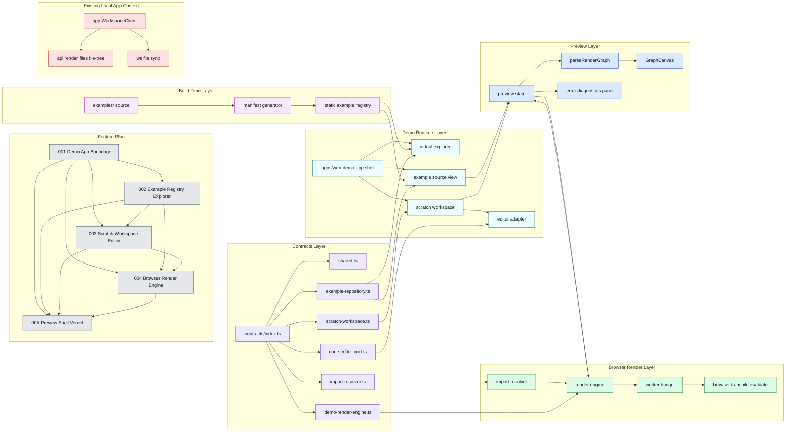

# Magam Web Demo for Vercel

## 문서 목적

이 문서는 magam 프로젝트를 Vercel에 배포 가능한 데모 경험으로 재구성하기 위한 PRD와 구현 계획을 함께 정의한다.

현재 앱은 로컬 Bun 서버와 로컬 파일 시스템을 전제로 동작한다. 반면 데모는 별도 서버 설치 없이 브라우저에서 바로 열리고, `examples/`를 탐색하고, 일부 코드를 직접 수정해 결과를 즉시 확인할 수 있어야 한다.

본 문서는 그 차이를 메우기 위한 제품 요구사항, 기술 제약, 계약, 단계별 구현 전략을 한 곳에 고정하는 것을 목표로 한다.

---

## 1. Executive Summary

### Problem Statement

현재 `app` 프런트엔드는 `localhost:3002` HTTP 렌더 서버와 `localhost:3001` WebSocket 편집 서버를 전제로 한다. 이 구조는 로컬 개발에는 적합하지만, Vercel 같은 정적/서버리스 배포 환경에서는 그대로 동작하지 않는다.

또한 사용자는 magam의 핵심 가치를 데모에서 즉시 체감해야 한다. 단순 소개 페이지가 아니라, 예제 탐색, 코드 열람, scratch 편집, 실시간 프리뷰까지 이어지는 인터랙티브 경험이 필요하다.

### Proposed Solution

Vercel용 web demo는 같은 저장소 안의 별도 앱 `apps/web-demo`로 정의하고, 기존 웹과 분리된 별도 Vercel 프로젝트로 배포한다. 이 앱은 `examples/` 중 명시적으로 선택된 일부를 읽기 전용 가상 탐색기로 제공하고, `sessionStorage` 기반 scratch editor에서만 편집을 허용하며, TSX transpile/render는 브라우저 워커에서 처리한다.

기존 로컬 워크스페이스 앱과는 라우트 수준 분리가 아니라 앱/의존성 수준 분리를 적용한다. 기존 `/api/render`, `/api/files`, `/api/file-tree`, WebSocket JSON-RPC 경로는 기존 앱에만 남기고, demo 앱은 인터페이스 기반 구현체만 사용하도록 한다.

### Success Criteria

- 사용자는 Vercel 배포 환경에서 추가 서버 없이 `examples/` 트리를 탐색할 수 있다.
- 사용자는 선택한 예제를 읽기 전용으로 확인하고, `Edit in Scratch`를 통해 별도 편집 세션을 시작할 수 있다.
- scratch 편집 후 프리뷰는 debounce 기준 500ms 이내에 새 렌더 요청을 시작한다.
- 렌더 실패 시 마지막 정상 그래프를 유지하고, 오류 패널에 메시지와 가능한 위치 정보를 표시한다.
- Vercel preview/deployment에서 첫 진입, 예제 선택, scratch 편집, 프리뷰 갱신이 모두 정상 동작한다.

---

## 2. 현재 구조와 문제 진단

### 현재 앱 구조

저장소의 현재 동작 방식은 아래와 같다.

- `app/app/page.tsx`는 `WorkspaceClient`를 바로 렌더한다.
- `WorkspaceClient`는 파일 목록을 `/api/files`, 그래프 렌더를 `/api/render`에서 가져온다.
- `Sidebar`는 `/api/file-tree`를 호출해 로컬 워크스페이스 탐색기를 만든다.
- `useFileSync`는 `ws://localhost:3001`에 연결해 로컬 파일 변경과 JSON-RPC 편집을 처리한다.
- `/api/*` 라우트는 결국 로컬 `MAGAM_HTTP_PORT` 서버를 프록시한다.

즉, 현재 앱은 "브라우저 단독 데모"가 아니라 "로컬 워크스페이스를 원격 제어하는 개발용 셸"에 가깝다.

### 문제의 본질

Vercel 데모는 아래 전제와 충돌한다.

- 로컬 파일 시스템을 읽고 수정할 수 없다.
- `localhost` HTTP/WS 서버에 접근할 수 없다.
- 장기 프로세스 기반 파일 watcher와 WebSocket 서버를 둘 수 없다.
- 서버 측 `esbuild + require + worker_threads` 실행은 브라우저 친화적이지 않다.

따라서 데모용 구조는 "서버 프록시를 브라우저에서 대체하는 설계"가 아니라, "브라우저 우선 동작 모델의 별도 demo 앱"이 되어야 한다.

---

## 3. 제품 목표와 범위

### 목표

1. Vercel에서 별도 Bun 서버 없이 동작하는 인터랙티브 데모를 제공한다.
2. 사용자가 `examples/`를 사이드바에서 가상 탐색기처럼 탐색할 수 있게 한다.
3. 선택한 예제를 읽기 전용 코드 뷰와 프리뷰로 확인할 수 있게 한다.
4. 사용자가 scratch editor에서 코드를 수정하고 결과를 실시간 확인할 수 있게 한다.
5. 오류가 발생해도 프리뷰가 완전히 사라지지 않고, 안전한 피드백 경로를 제공한다.

### 비목표

1. 배포 환경에서 실제 파일 저장을 지원하지 않는다.
2. WebSocket 기반 양방향 패치와 로컬 파일 감시는 포함하지 않는다.
3. 채팅/세션 관리, 그룹 관리 등 현재 앱의 전체 협업 기능을 데모에 포함하지 않는다.
4. 사용자가 `examples/` 원본을 직접 수정하는 기능은 제공하지 않는다.
5. 멀티유저 협업, 인증, 권한 관리, 히스토리 영속 저장은 이번 범위에 넣지 않는다.

### 대상 사용자

- magam을 처음 접하는 잠재 사용자
- 문서보다 실제 예제를 먼저 보고 싶은 개발자
- 라이브 코딩으로 기능 감각을 빠르게 확인하고 싶은 내부/외부 데모 청중

---

## 4. 핵심 사용자 경험

### UX 원칙

1. 데모는 즉시 열려야 한다.
2. 예제 원본과 사용자 실험 공간은 명확히 분리되어야 한다.
3. 편집 실패가 곧 빈 화면이 되면 안 된다.
4. 로컬 앱과 혼동되지 않도록 "demo mode"임을 UI에서 명확히 드러내야 한다.

### 주요 사용자 흐름

#### 4.1 예제 탐색

1. 사용자가 web demo에 진입한다.
2. 좌측 사이드바에 `examples/` 기반 가상 탐색기가 보인다.
3. 폴더를 펼치고 파일을 선택한다.
4. 우측에는 선택한 예제의 코드와 렌더 결과가 표시된다.

#### 4.2 Scratch 편집

1. 사용자가 `Edit in Scratch`를 누른다.
2. 현재 예제 소스가 scratch editor에 복제된다.
3. 예제 원본은 계속 읽기 전용으로 남는다.
4. 사용자는 scratch에서만 코드를 수정한다.
5. 변경 후 debounce가 지나면 브라우저 워커가 다시 transpile/render를 수행한다.

#### 4.3 오류 복구

1. 사용자가 문법 오류나 지원하지 않는 코드를 입력한다.
2. 렌더 워커가 diagnostics를 반환한다.
3. UI는 마지막 정상 프리뷰를 유지한다.
4. 오류 패널에는 메시지, 파일명, 라인/컬럼, 복구 가이드를 보여준다.

---

## 5. 사용자 스토리와 Acceptance Criteria

### Story A. 예제 탐색

As a 데모 방문자, I want to browse prebuilt examples in a sidebar so that I can quickly understand what magam can render.

Acceptance Criteria:

- 사이드바는 `examples/` 구조를 반영한 폴더/파일 트리를 표시한다.
- 파일 노드는 클릭 가능하고, 폴더 노드는 expand/collapse 가능하다.
- 현재 선택된 파일은 시각적으로 강조된다.
- 탐색기는 읽기 전용 상태임이 명시된다.

### Story B. 예제 열람

As a 데모 방문자, I want to open an example and immediately see both code and preview so that I can connect TSX source with rendered output.

Acceptance Criteria:

- 파일 선택 시 코드 뷰와 프리뷰가 동시에 갱신된다.
- 초기 진입 시 기본 예제가 자동 선택된다.
- 기본 진입 예제는 `examples/readme.tsx`를 기준으로 하되, override 설정으로 교체 가능하다.
- 모바일에서는 preview만 기본 표시하고, explorer/code는 탭 기반 사이드 패널로 전환한다.

### Story C. Scratch 편집

As a 데모 방문자, I want to copy an example into a scratch editor and modify it so that I can experiment without changing the original.

Acceptance Criteria:

- `Edit in Scratch` 액션은 선택한 예제의 현재 소스를 scratch로 복제한다.
- scratch와 example view는 역할이 명확히 구분된다.
- scratch 편집 결과는 새로고침 전까지 `sessionStorage` 범위에서 유지된다.
- 원본 example source는 어떤 경우에도 수정되지 않는다.

### Story D. 실시간 프리뷰

As a 데모 방문자, I want my scratch edits to update the canvas quickly so that the experience feels interactive.

Acceptance Criteria:

- 입력 후 debounce 기준으로 렌더가 실행된다.
- 이전 렌더보다 늦게 도착한 stale 결과는 무시된다.
- 렌더 성공 시 `GraphCanvas`에 반영된다.

### Story E. 오류 피드백

As a 데모 방문자, I want useful error feedback when my code fails so that I can recover without losing context.

Acceptance Criteria:

- 오류 발생 시 마지막 정상 그래프를 유지한다.
- 에러 패널은 메시지, 위치 정보, 기본 복구 안내를 제공한다.
- 로딩 중 상태와 오류 상태가 구분된다.

---

## 6. 기능 요구사항

### 6.1 Separate Demo App 분리

- web demo는 `apps/web-demo`에 위치하는 별도 앱으로 구성한다.
- web demo는 기존 웹과 분리된 별도 Vercel 프로젝트로 배포한다.
- demo 앱은 기존 `WorkspaceClient` 흐름을 import하거나 감싸지 않는다.
- demo 앱에서는 아래 동작을 금지한다.
  - `/api/render` 호출
  - `/api/files` 호출
  - `/api/file-tree` 호출
  - `useFileSync`를 통한 WebSocket 연결
- 로컬 워크스페이스 앱은 기존 동작을 유지한다.

### 6.2 Examples 데이터 공급

- 빌드 시 `examples/`를 스캔해 정적 manifest를 생성한다.
- manifest는 폴더 구조, 파일 경로, 제목, 카테고리, 소스 문자열을 포함한다.
- manifest는 전체 자동 노출이 아니라 포함 파일 기준으로 명시적으로 선택된 example subset만 노출한다.
- 파일명 기반 자동 메타데이터를 기본으로 하되, 수동 override 파일로 제목, 설명, 기본 진입 파일을 덮어쓸 수 있어야 한다.

### 6.3 가상 탐색기

- 기존 `Sidebar`/`FolderTreeItem`의 시각적 패턴은 참고할 수 있지만, 구현은 demo 앱 내부 또는 shared presentational layer에 둔다.
- 데이터 소스는 API가 아니라 정적 manifest 기반 트리다.
- 탐색기는 읽기 전용이다.

### 6.4 코드 뷰와 Scratch Editor

- example source panel은 읽기 전용이다.
- scratch panel은 편집 가능하다.
- scratch editor는 lazy load한다.
- 기본 권장 에디터는 `CodeMirror`이며, `Monaco`는 고급 편집 기능이 반드시 필요할 때만 대체안으로 검토한다.
- scratch는 한 번에 하나만 유지한다.
- dirty indicator는 이번 범위에 포함하지 않는다.

### 6.5 브라우저 렌더 파이프라인

- TSX transpile과 graph 생성은 브라우저 워커에서 처리한다.
- 입력은 `source`, `filename`, `mode`를 포함한다.
- 출력은 `graph`, `sourceVersion`, `diagnostics`를 포함한다.
- 렌더는 격리된 실행 경계를 가져야 하며, UI 스레드를 장시간 막지 않아야 한다.

### 6.6 프리뷰/오류 상태 관리

- 성공 시 `parseRenderGraph`를 거쳐 기존 `GraphCanvas`를 재사용한다.
- 실패 시 `lastGoodGraph`를 유지한다.
- 로딩, 성공, 실패 상태는 UI에서 명확히 구분한다.

### 6.7 배포 요구사항

- 데모는 Vercel에서 동작해야 한다.
- browser worker와 필요한 정적 자산은 빌드 아웃풋에 포함되어야 한다.
- 로컬 포트, 로컬 경로, 워크스페이스 루트 의존성을 제거한다.

---

## 7. 비기능 요구사항

### 성능

- 초기 예제 선택 후 첫 프리뷰는 체감상 즉시 나타나야 한다.
- scratch 렌더는 연속 입력 동안 UI 상호작용을 막지 않아야 한다.
- 불필요한 전체 재렌더를 줄이기 위해 debounce와 stale result 차단 규칙을 둔다.

### 안정성

- 렌더 실패가 전체 화면 붕괴로 이어지면 안 된다.
- 마지막 정상 렌더를 복구 기준점으로 유지한다.
- manifest 누락 또는 잘못된 예제 메타데이터는 graceful error로 드러나야 한다.

### 보안

- 데모는 로컬 파일 시스템 쓰기를 수행하지 않는다.
- 사용자 입력 코드는 브라우저 내부 격리 경계에서만 실행한다.
- 원격 임의 네트워크 요청이나 위험한 런타임 접근은 가능한 범위에서 제한한다.

### 접근성/반응형

- 사이드바, 예제 선택, scratch 전환은 키보드로 접근 가능해야 한다.
- 데스크톱은 code/preview 2열 레이아웃을 사용한다.
- 모바일에서는 preview만 기본 표시하고 explorer/code는 별도 탭 패널로 연다.

---

## 8. 공개 계약 정의

상세 계약은 `docs/features/webdemo/contracts/` 아래의 `ts` 파일로 고정한다. 문서에는 역할만 남기고, 실제 함수 시그니처와 입출력 구조는 계약 파일을 기준으로 관리한다.

계약 원칙:

- 계약은 구현체가 아니라 인터페이스와 입출력 구조만 정의한다.
- 각 계약은 하나의 역할 책임만 가진다.
- 역할 책임과 비책임 범위는 각 `ts` 파일 상단 주석에 명시한다.
- 구현 방식은 이후 코드베이스 상황에 따라 선택하되, 계약을 먼저 깨지 않도록 한다.

현재 고정한 계약 목록:

- `docs/features/webdemo/contracts/shared.ts`
  - 공통 값 타입
  - 예제 노드, diagnostics, scratch 문서, UI 상태 값
- `docs/features/webdemo/contracts/example-repository.ts`
  - 가상 파일 탐색기용 예제 트리 조회
  - 읽기 전용 예제 소스 읽기
- `docs/features/webdemo/contracts/scratch-workspace.ts`
  - 예제를 scratch 문서로 복제
  - 메모리 기반 scratch 문서 읽기, 수정, 리셋
- `docs/features/webdemo/contracts/code-editor-port.ts`
  - 구체 에디터 구현과 무관한 editor mount/lifecycle 계약
- `docs/features/webdemo/contracts/import-resolver.ts`
  - 상대 import를 demo-safe 방식으로 해석하는 계약
- `docs/features/webdemo/contracts/demo-render-engine.ts`
  - source 입력을 graph + diagnostics 출력으로 바꾸는 렌더 계약
- `docs/features/webdemo/contracts/index.ts`
  - 계약 re-export 진입점

의존성 규칙:

- demo 앱은 기존 `app`의 API/WS 구현체에 의존하지 않는다.
- 기존 앱은 demo 앱의 구현체를 import하지 않는다.
- 공유가 필요하면 계약과 순수 유틸만 shared layer로 올린다.

---

## 9. 제안 아키텍처

### 9.1 상위 구조

```text
examples/ source
   ↓
build-time manifest generator
   ↓
apps/web-demo static registry
   ↓
apps/web-demo runtime
   ├─ virtual explorer
   ├─ example source viewer
   ├─ scratch editor
   └─ preview panel
          ↓
     browser render worker
          ↓
     parseRenderGraph
          ↓
       GraphCanvas
```

### 9.1.1 Full Layer Diagram



색상 규칙:

- 회색: 서브 피쳐 번호 레이어
- 보라: 계약 레이어
- 분홍: 빌드타임 데이터 레이어
- 청록: demo 런타임 레이어
- 초록: 브라우저 렌더 레이어
- 파랑: 프리뷰 레이어
- 빨강: 기존 로컬 앱 컨텍스트

### 9.2 저장소 구조 권장안

```text
docs/features/webdemo/
  README.md
  contracts/
  001-demo-app-boundary/
  002-example-registry-explorer/
  003-scratch-workspace-editor/
  004-browser-render-engine/
  005-preview-shell-vercel/

apps/web-demo/
  app/
  components/
  lib/examples/
  lib/editor/
  lib/render/
  workers/

libs/
  core/
  shared/      (기존)
  demo-shared/ (필요 시 계약/순수 유틸만)

app/           (기존 로컬 워크스페이스 앱)
```

### 9.3 책임 분리

- 로컬 앱 책임
  - 실제 파일 목록 조회
  - 로컬 TSX 파일 렌더 요청
  - WebSocket 기반 편집 동기화
- web demo 책임
  - 정적 example registry 로딩
  - 브라우저 메모리 기반 scratch 편집
  - 브라우저 워커 기반 transpile/render

### 9.4 왜 별도 앱 분리인가

기존 워크스페이스 셸에 조건문이나 route만 추가하는 방식은 위험하다.

- `/api/*`와 WS 의존이 깊게 섞여 있다.
- demo-safe 상태 관리와 workspace-safe 상태 관리가 다르다.
- 데모에 필요 없는 채팅/탭/파일 동기화 로직이 번들에 남는다.
- "기존 웹과 어떠한 영향도 받지 않아야 한다"는 요구를 route 분리만으로는 보장하기 어렵다.

따라서 같은 저장소 안의 별도 앱 분리가 필요하다.

### 9.5 서브 피쳐 분해 전략

이번 작업은 한 번의 feature로 끝내기 어렵다. 작업량과 선행 의존성을 기준으로 아래 5개 서브 피쳐로 분해한다.

1. `001-demo-app-boundary`
   - 가장 먼저 고정해야 하는 앱/패키지 경계
   - 다른 모든 서브 피쳐의 선행 조건
2. `002-example-registry-explorer`
   - 예제 공급 경로와 가상 탐색기
   - demo가 실제로 무엇을 보여줄지 결정하는 기반
3. `003-scratch-workspace-editor`
   - 메모리 기반 편집과 editor integration
   - 사용자 인터랙션의 핵심
4. `004-browser-render-engine`
   - 가장 큰 작업량과 리스크를 가진 핵심 서브 피쳐
   - 브라우저 transpile, import 해석, worker 실행, diagnostics를 포함
5. `005-preview-shell-vercel`
   - preview 통합, 오류 UX, 모바일 대응, 실제 Vercel hardening

현재 판단 기준:

- 가장 큰 작업량:
  - `004-browser-render-engine`
- 선행 의존성 구현 비중이 큰 항목:
  - `001-demo-app-boundary`
  - `002-example-registry-explorer`
  - `003-scratch-workspace-editor`

각 서브 피쳐의 상세 범위는 아래 문서에서 관리한다.

- `docs/features/webdemo/001-demo-app-boundary/README.md`
- `docs/features/webdemo/002-example-registry-explorer/README.md`
- `docs/features/webdemo/003-scratch-workspace-editor/README.md`
- `docs/features/webdemo/004-browser-render-engine/README.md`
- `docs/features/webdemo/005-preview-shell-vercel/README.md`

---

## 10. 기술 설계 세부사항

### 10.1 Demo App 전략

권장안:

- `apps/web-demo`를 별도 Next 앱으로 추가한다.
- 기존 `app`과 빌드/런타임/의존성 경계를 분리한다.
- Vercel에서는 기존 웹과 분리된 별도 프로젝트로 배포한다.

필요 변경:

- 루트 workspace 설정에 `apps/web-demo`를 포함한다.
- demo 전용 page/component/store를 새 앱 안에 둔다.
- 기존 `WorkspaceClient`와 demo 앱 사이에 직접 import 경로를 만들지 않는다.

### 10.2 Static Manifest 생성

권장안:

- 빌드 시 `examples/`를 순회해 manifest TS 파일을 생성한다.
- 생성 결과는 `apps/web-demo`에서 직접 import 가능해야 한다.
- manifest 산출물은 저장소 커밋 대상이 아니라 build 시에만 생성한다.

manifest 생성기가 해야 할 일:

1. `.tsx` 파일만 수집한다.
2. 포함 대상 파일 목록만 manifest에 넣는다.
3. 폴더 구조를 트리로 보존한다.
4. 파일별 `source` 문자열을 포함한다.
5. 제목은 파일명 기반 기본값을 생성하되, 수동 override 파일로 덮어쓸 수 있게 한다.
6. 기본 진입 파일은 `examples/readme.tsx`를 기본값으로 두되, override로 변경 가능해야 한다.

### 10.3 가상 탐색기 UI

재사용 원칙:

- 기존 앱 UI를 직접 import하기보다, 필요한 경우 순수 presentational 조각만 shared layer로 추출한다.
- 1차 구현에서는 demo 앱 내부 컴포넌트로 독립 구현하는 편이 더 안전하다.

변경 원칙:

- API 호출 로직은 애초에 포함하지 않는다.
- read-only badge 또는 안내 문구를 추가한다.
- 예제용 선택 상태와 워크스페이스 파일 상태를 코드 레벨에서 분리한다.

### 10.4 Source View / Scratch Editor

패널 구성 권장:

1. Explorer
2. Source
3. Preview

scratch가 열리면 Source 패널은 탭 구조로 확장한다.

- `Example Source`
- `Scratch`

에디터 정책:

- example source는 read-only
- scratch는 editable
- scratch는 `sessionStorage`까지 사용
- scratch는 한 번에 하나만 유지
- `Reset to Example`, `Copy Source`, `Edit in Scratch` 액션 제공
- 권장 에디터는 `CodeMirror`
- `Monaco`는 추후 확장 후보
- dirty indicator는 제공하지 않음

### 10.5 Browser Render Worker

현재 서버 측 렌더 파이프라인:

1. TSX 파일 읽기
2. `esbuild`로 transpile
3. JS 실행
4. `@magam/core`의 `renderToGraph` 호출
5. 결과를 `parseRenderGraph`로 전달

demo용 대체 파이프라인:

1. 브라우저에서 source 문자열 확보
2. worker 내부에서 transpile
3. 안전한 런타임 경계에서 모듈 평가
4. `renderToGraph` 호출
5. graph/diagnostics 반환

설계 원칙:

- UI thread는 worker와 메시지로만 통신한다.
- 요청마다 `requestId`를 두고 최신 요청만 반영한다.
- worker 초기화 비용이 크면 singleton worker를 재사용한다.
- render engine은 `DemoRenderEngine` 계약 뒤에 숨긴다.

### 10.6 Preview 상태 머신

```text
idle
  ↓ select example
loading
  ↓ success
ready
  ↓ scratch change
loading
  ↓ failure
error (with lastGoodGraph retained)
```

세부 규칙:

- `example-view` 선택 시 즉시 렌더 시작
- scratch 입력 중 이전 요청이 완료돼도 최신 요청이 아니면 버림
- 오류 발생 시 `previewStatus='error'`로 바꾸되 `lastGoodGraph`는 유지

### 10.7 Vercel 배포 관점

반드시 정리할 항목:

- worker 번들 파일 포함 방식
- wasm 자산 포함 여부와 public path
- dynamic import 가능한 editor 패키지 번들 전략
- demo 앱이 serverless/edge 제약 없이 동작하도록 브라우저 우선 실행 보장

환경 변수 정책:

- `MAGAM_HTTP_PORT`, `MAGAM_WS_PORT`, `MAGAM_TARGET_DIR`는 demo 경로에서 사용하지 않는다.
- demo-safe 기본값만 허용한다.

### 10.8 Demo 전용 의존성 요구사항

필수 후보:

- `esbuild-wasm`
- `@codemirror/state`
- `@codemirror/view`
- `@codemirror/lang-javascript`

선택 후보:

- `@codemirror/theme-one-dark` 또는 커스텀 테마 패키지
- `comlink`
- `monaco-editor` 또는 `@monaco-editor/react`

원칙:

- demo 전용 의존성은 `apps/web-demo`에만 머물러야 한다.
- 기존 `app`이 demo 전용 편집기/렌더러 패키지에 역의존하면 안 된다.

---

## 11. 구현 계획

### Phase 1. Demo App 스캐폴드와 레이어 경계 확정

목표:

- 로컬 워크스페이스 앱과 Vercel 데모 앱의 앱/의존성 경계를 분리한다.

작업:

- `apps/web-demo` 앱 추가
- 루트 workspace 연결
- demo contracts와 infra layer 뼈대 추가
- 기존 workspace 전용 API/WS 흐름이 demo 앱에서 import되지 않도록 차단

완료 기준:

- demo 앱 실행 시 `/api/*` 및 WebSocket 연결이 발생하지 않는다.

### Phase 2. Static Example Registry

목표:

- `examples/`를 정적 데이터로 공급한다.

작업:

- examples manifest 생성 스크립트 또는 생성 모듈 추가
- 트리 구조와 source 포함 계약 고정
- 포함 파일 기준 큐레이션 규칙 정의
- 기본 예제 선택 규칙 정의
- `ExampleRepository` 구현체 확정

완료 기준:

- 예제 선택 UI가 API 없이 정적으로 동작한다.

### Phase 3. Explorer + Read-only Source View

목표:

- 사용자가 예제를 탐색하고 열람할 수 있게 한다.

작업:

- demo 앱 전용 explorer 컴포넌트 구현
- read-only 표시 추가
- 코드 뷰 패널과 프리뷰 패널 기본 레이아웃 구성

완료 기준:

- 파일 선택 시 예제 코드와 프리뷰 대상이 함께 바뀐다.

### Phase 4. Scratch Editor + Live Preview

목표:

- 사용자가 scratch에서 코드 수정과 실시간 프리뷰를 경험할 수 있게 한다.

작업:

- lazy-loaded `CodeMirror` editor 추가
- `Edit in Scratch`, `Reset`, `Copy` 액션 추가
- debounce, stale result guard, 상태 표시 구현
- `CodeEditorAdapter` 계약 확정
- `sessionStorage` 복원 정책 연결
- 단일 scratch 문서 정책 연결

완료 기준:

- scratch 편집 후 프리뷰가 안정적으로 갱신된다.

### Phase 5. Browser Render Worker

목표:

- 서버 없는 렌더 파이프라인을 완성한다.

작업:

- worker 입력/출력 계약 구현
- 브라우저 transpile/evaluate/render 경로 구현
- diagnostics 정규화
- `DemoRenderEngine` 구현체 연결

완료 기준:

- example source와 scratch source 모두 브라우저 내에서 렌더 가능하다.

### Phase 6. Vercel Hardening

목표:

- 실제 배포 품질을 확보한다.

작업:

- worker/editor/manifest 번들 검증
- demo 전용 환경 변수 정리
- 모바일 레이아웃과 에러 UX 마감
- 기존 웹과 분리된 별도 Vercel 프로젝트 배포 설정 검증

완료 기준:

- Vercel preview build와 수동 QA를 통과한다.

---

## 12. 테스트 계획

### 12.1 단위 테스트

- manifest 생성
  - 중첩 디렉터리 구조 보존
  - 포함 파일 리스트 반영
  - override 반영
- demo state
  - 예제 선택
  - scratch 생성/초기화
  - `sessionStorage` 복원
  - stale render 결과 무시
- diagnostics 정규화
  - line/column 추출
  - syntax/runtime error 매핑

### 12.2 컴포넌트 테스트

- explorer 렌더
  - 폴더 토글
  - 파일 선택
  - read-only 표시
- source/scratch 패널
  - `Edit in Scratch`
  - `Reset to Example`
  - 모바일 explorer/code 탭 전환

### 12.3 통합 테스트

- 기본 예제 로드 후 프리뷰 성공
- scratch 수정 후 프리뷰 재렌더
- 문법 오류 입력 후 diagnostics 표시
- 오류 상태에서 마지막 정상 프리뷰 유지
- demo 앱에서 `/api/render`, `/api/files`, `/api/file-tree`, WebSocket 호출이 발생하지 않음
- 기존 `app`이 demo 전용 의존성을 import하지 않음

### 12.4 배포 검증

- Vercel preview build 성공
- 기존 웹과 분리된 별도 Vercel 프로젝트 배포 확인
- 첫 진입과 scratch 수정 후 렌더링 확인
- 데스크톱/모바일 레이아웃 수동 점검

---

## 13. 리스크와 대응

### 리스크 1. 브라우저에서 TSX 실행 비용이 크다

대응:

- worker 재사용
- editor lazy load
- 초기에는 대표 예제 수를 제한
- 필요 시 editor 기능 범위를 줄이고 CodeMirror 확장을 최소화

### 리스크 2. 일부 example이 브라우저 환경에 맞지 않는다

대응:

- manifest 생성 단계에서 지원 불가 예제 제외
- 지원 대상 목록을 명시적으로 관리

### 리스크 3. 오류 경험이 과도하게 거칠다

대응:

- diagnostics 정규화
- 마지막 정상 프리뷰 유지
- 복구 액션 버튼 제공

### 리스크 4. 로컬 앱과 데모 앱의 경계가 흐려진다

대응:

- app, state, data source, network, package 경계를 명확히 분리
- demo 앱에서 workspace 전용 훅 import/use를 금지한다
- 공유가 필요하면 구현체가 아니라 계약과 순수 유틸만 추출한다

---

## 14. 범위 이후 후보

- scratch 공유 링크
- example 검색
- example 태그/난이도 분류
- 지원 예제 메타데이터 수동 큐레이션
- 서버 저장을 포함한 고급 playground 모드

---

## 15. Assumptions

- 이 문서는 `docs/features/webdemo/README.md` 단일 파일에 PRD와 구현 계획을 함께 담는다.
- web demo는 같은 저장소 안의 별도 앱 `apps/web-demo`로 구축한다.
- Vercel에서는 기존 웹과 분리된 별도 프로젝트로 배포한다.
- scratch 편집 결과는 `sessionStorage` 범위까지 유지한다.
- `examples/` 원본은 항상 읽기 전용으로 유지한다.
- 데모 노출 예제는 포함 파일 기준으로 명시적으로 선택한다.
- 상대 import가 있는 예제는 demo용 번들 단계에서 해석 가능해야 하며, 그렇지 않으면 포함 대상에서 제외한다.
- 현재 작업 트리의 `package.json` 변경은 본 문서 작업 범위에 포함하지 않는다.
