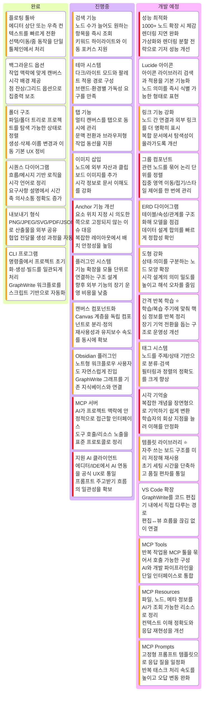

# GraphWrite TODO Kanban

```mermaid
kanban
  done[완료]
    task_toolbar[플로팅 툴바<br/>에디터 상단 또는 우측 컨텍스트를 빠르게 전환<br/>선택/이동/줌 동작을 단일 툴체인에서 처리]@{ priority: 'High' }
    task_background[백그라운드 옵션<br/>작업 맥락에 맞게 캔버스 시각 배경 제공<br/>점 잔상/그리드 옵션으로 집중력 보조]@{ priority: 'Neutral' }
    task_folders[폴더 구조<br/>파일/폴더 트리로 프로젝트를 탐색 가능한 상태로 정렬<br/>생성·삭제·이름 변경과 이동 기본 UX 정비]@{ priority: 'High' }
    task_sequence[시퀀스 다이어그램<br/>흐름/메시지 기반 로직을 시각 언어로 정리<br/>요구사항 설명에서 시간축 의사소통 정확도 증가]@{ priority: 'High' }
    task_export[내보내기 형식<br/>PNG/JPEG/SVG/PDF/JSON/MD로 산출물을 외부 공유<br/>협업 전달물 생성 과정을 자동화]@{ priority: 'High' }
    task_cli[CLI 프로그램<br/>명령줄에서 프로젝트 초기화·생성·빌드를 일관되게 처리<br/>GraphWrite 워크플로를 스크립트 기반으로 자동화]@{ priority: 'High' }
  inProgress[진행중]
    task_search[검색 기능<br/>노드 수가 늘어도 원하는 항목을 즉시 조회<br/>키워드 하이라이트와 이동 포커스 지원]@{ priority: 'High' }
    task_theme[테마 시스템<br/>다크/라이트 모드와 팔레트 적용 경로 구성<br/>브랜드·환경별 가독성 요구를 만족]@{ priority: 'High' }
    task_tabs[탭 기능<br/>멀티 캔버스를 탭으로 동시에 관리<br/>문맥 전환과 브라우저형 작업 동선을 지원]@{ priority: 'High' }
    task_image[이미지 삽입<br/>노드에 외부 자산과 클립보드 이미지를 추가<br/>시각 정보로 문서 이해도를 강화]@{ priority: 'High' }
    task_anchor[Anchor 기능 개선<br/>요소 위치 지정 시 의도한 쪽으로 고정되지 않는 이슈 대응<br/>복잡한 레이아웃에서 배치 안정성을 높임]@{ priority: 'Very High' }
    task_plugin[플러그인 시스템<br/>기능 확장을 모듈 단위로 연결하는 구조 설계<br/>향후 외부 기능의 장기 운영 비용을 낮춤]@{ priority: 'Very High' }
    task_canvas[캔버스 컴포넌트화<br/>Canvas 계층을 독립 컴포넌트로 분리·정의<br/>재사용성과 유지보수 속도를 동시에 확보]@{ priority: 'High' }
    task_obsidian[Obsidian 플러그인<br/>노트형 워크플로우 사용자도 자연스럽게 진입<br/>GraphWrite 그래프를 기존 지식베이스와 연결]@{ priority: 'High' }
    task_mcpServer[MCP 서버<br/>AI가 프로젝트 맥락에 안정적으로 접근할 인터페이스<br/>도구 호출/리소스 노출을 표준 프로토콜로 정리]@{ priority: 'Very High' }
    task_aiClient[지원 AI 클라이언트<br/>에디터/IDE에서 AI 연동을 공식 UX로 통일<br/>프롬프트 주고받기 흐름의 일관성을 확보]@{ priority: 'Very High' }
  planned[개발 예정]
    task_performance[성능 최적화<br/>1000+ 노드 확장 시 체감 렌더링 지연 완화<br/>가상화와 렌더링 분할 전략으로 기저 성능 개선]@{ priority: 'Very High' }
    task_icons[Lucide 아이콘<br/>아이콘 라이브러리 검색과 적용을 기본 기능화<br/>노드 의미를 즉시 식별 가능한 형태로 표현]@{ priority: 'Neutral' }
    task_link[링크 기능 강화<br/>노드 간 연결과 외부 링크를 더 명확히 표시<br/>복합 문서에서 탐색성이 올라가도록 개선]@{ priority: 'High' }
    task_group[그룹 컴포넌트<br/>관련 노드를 묶어 논리 단위를 정렬<br/>집중 영역 이동/접기/스타일 제어를 한 번에 관리]@{ priority: 'Very High' }
    task_erd[ERD 다이어그램<br/>테이블/속성/관계를 구조화해 모델을 점검<br/>데이터 설계 합의를 빠르게 정합성 확인]@{ priority: 'High' }
    task_shape[도형 강화<br/>상태·의미를 구분하는 노드 모양 확장<br/>시각 설계의 의미 밀도를 높이고 해석 오차를 줄임]@{ priority: 'High' }
    task_repetition[간격 반복 학습 ⭐<br/>학습/복습 주기에 맞춰 핵심 정보를 반복 정리<br/>장기 기억 전환을 돕는 구조로 운영성 개선]@{ priority: 'Very High' }
    task_tag[태그 시스템<br/>노드를 주제/상태 기반으로 분류·검색<br/>필터링과 정렬의 정확도를 크게 향상]@{ priority: 'High' }
    task_mnemonic[시각 기억술<br/>복잡한 개념을 장면형으로 기억하기 쉽게 변환<br/>학습자의 회상 지점을 늘려 이해를 안정화]@{ priority: 'Very High' }
    task_template[템플릿 라이브러리 ⭐<br/>자주 쓰는 보드 구조를 미리 저장해 재사용<br/>초기 세팅 시간을 단축하고 품질 편차를 통일]@{ priority: 'High' }
    task_vscode[VS Code 확장<br/>GraphWrite를 코드 편집기 내에서 직접 다루는 경로<br/>편집↔뷰 흐름을 끊김 없이 연결]@{ priority: 'Neutral' }
    task_mcpTools[MCP Tools<br/>반복 작업용 MCP 툴을 묶어서 호출 가능한 구성<br/>AI와 개발 파이프라인을 단일 인터페이스로 통합]@{ priority: 'High' }
    task_mcpResource[MCP Resources<br/>파일, 노드, 메타 정보를 AI가 조회 가능한 리소스로 정리<br/>컨텍스트 이해 정확도와 응답 재현성을 개선]@{ priority: 'High' }
    task_mcpPrompt[MCP Prompts<br/>고정형 프롬프트 템플릿으로 응답 질을 일정화<br/>반복 태스크 처리 속도를 높이고 오답 변동 완화]@{ priority: 'High' }
```

## 제외 항목

- 노드 ID 복사: 구현 완료([x])로 현재 예정/진행 목록에서 제외
